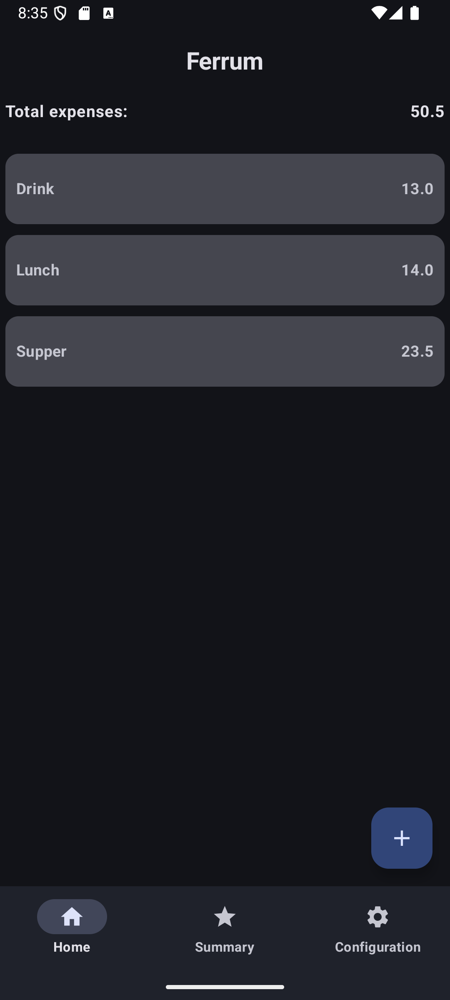

# Ferrum

An expense notebook for Android (very early stage)

## Motivation

I'm still a student at 20+ year-o but I want to track all my spends as I get financial supports from my parents. By
this way I want to be aware of how difficult and hard that working is.

I want to express respect and gratitude to my parents.

## Todo

- [x] Add item (with limited features)
- [x] Delete item (long press)
- [ ] Animation
- [ ] basic item CRUD
- [ ] Expense summary
  - [ ] Week
  - [ ] Month
  - [ ] Year
- [ ] Configuration Page
  - [ ] Customized theme
- [ ] Migrate to [Gradm](https://github.com/Omico/Gradm)
- [ ] GitHub Android App CI/CD

> [!WARNING]
> The project may get lots of force pushes currently. Do not contribute to it. Please open new issue if you have some ideas to share.

## Plan

This app is very rough, but due to my limited skills, it initially took me 8 hours just to complete
the basic features: adding and deleting entries, and basic UIs. The state of the project is very chaotic;
I kept modifying the code until it finally worked. But I know this isn't sustainable.
I’m trying to reorganize my thoughts and relearn Flow and coroutines,
hoping to improve the project’s state management.

There might be serious errors in the project’s  UI state management.

This is my first open source project, it's my tech playground.

## Screenshots

  
  &nbsp;&nbsp;&nbsp;&nbsp;
  

## License

**Currently** no license.
